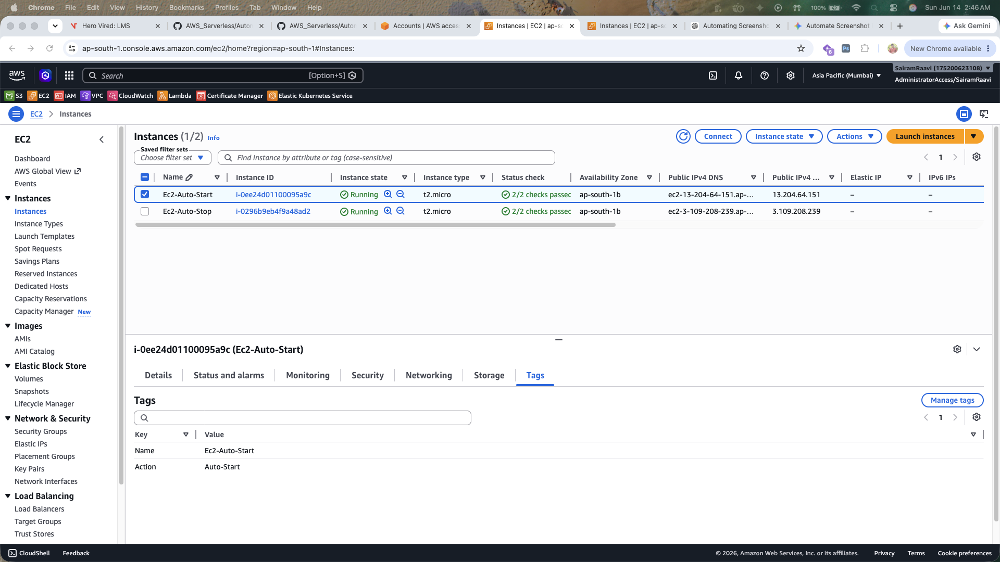
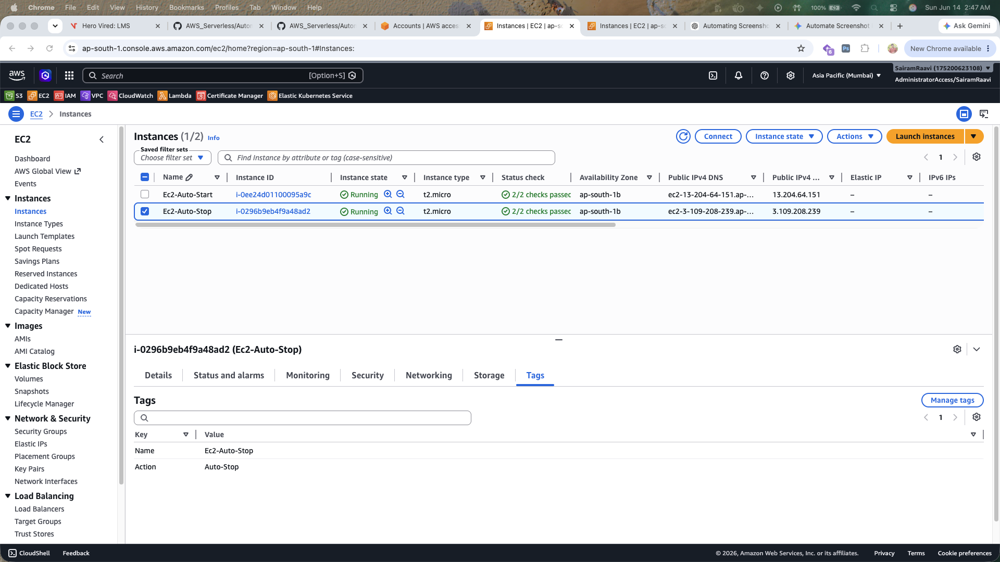
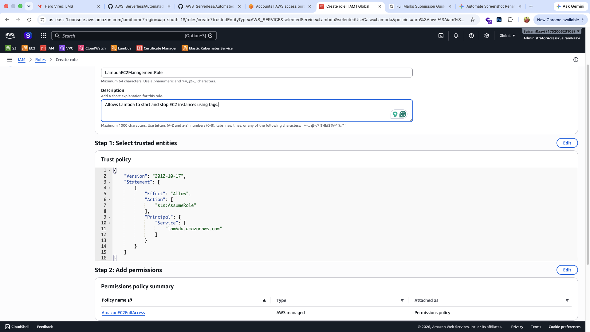
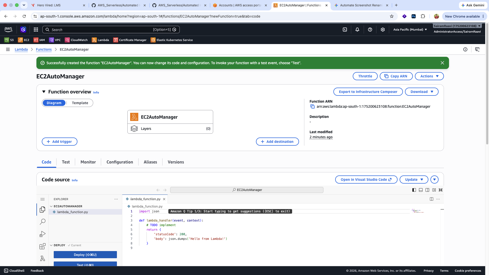
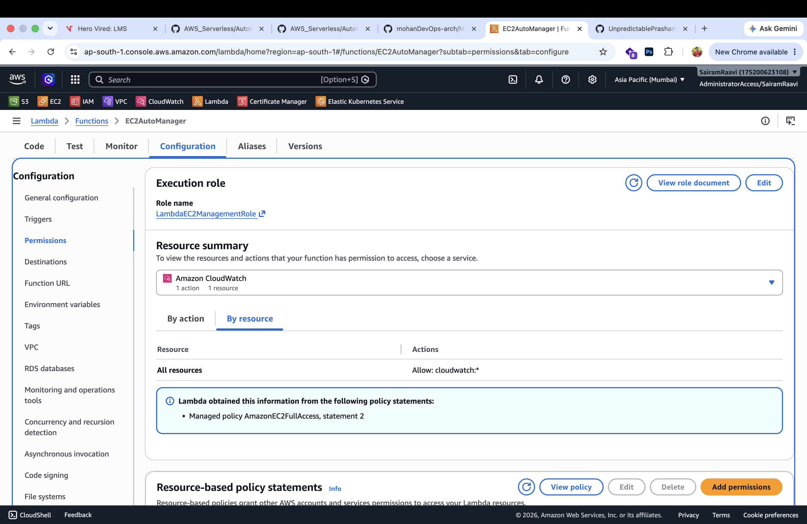
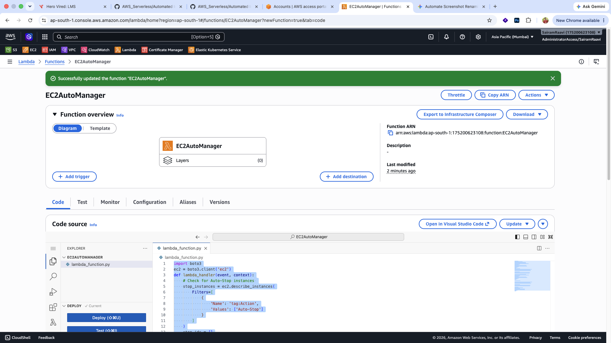
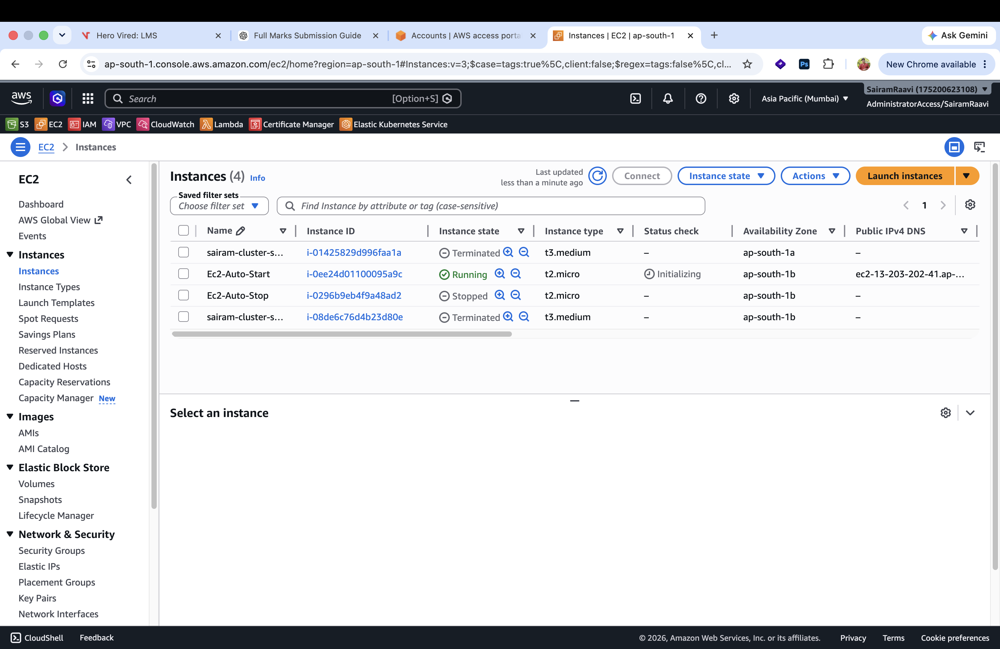
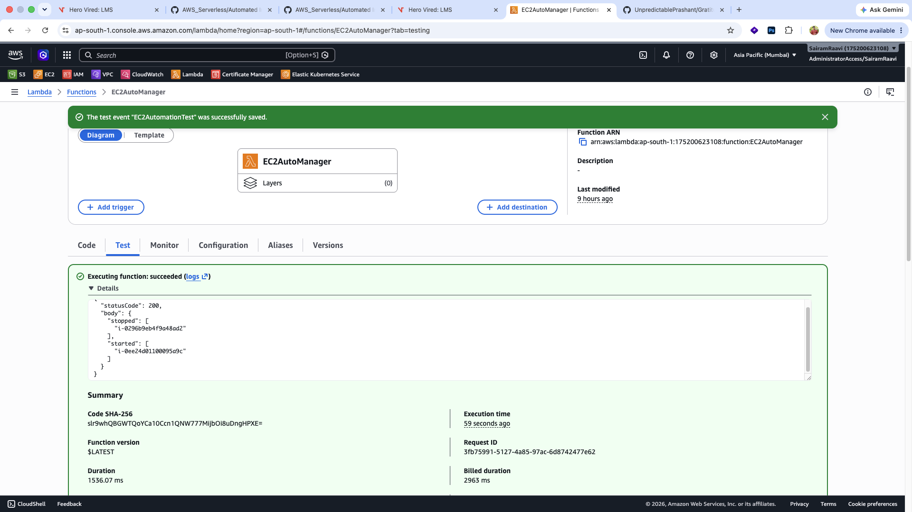
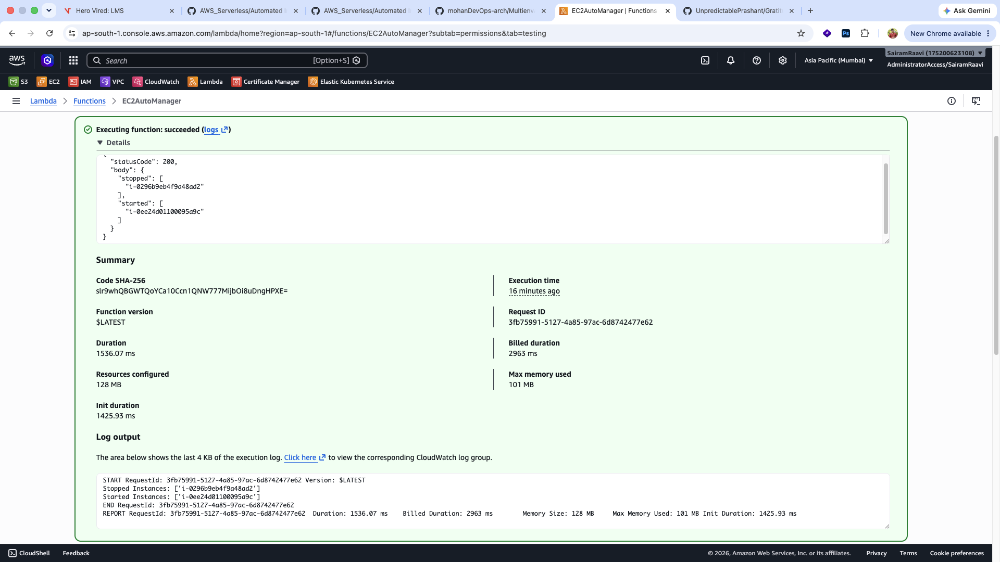
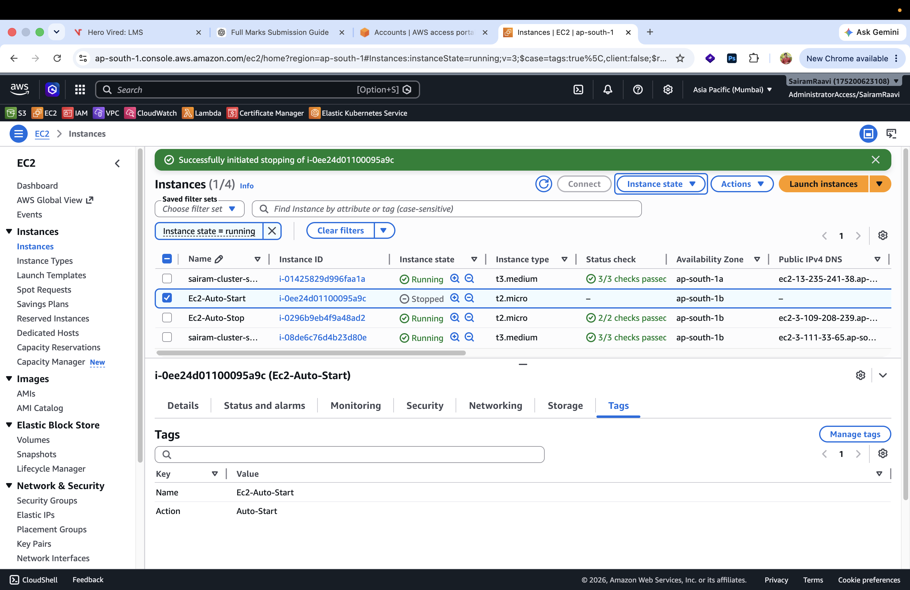

# AWS Lambda EC2 Automation Using Boto3

## Assignment Overview

This project demonstrates how to automate Amazon EC2 instance management using AWS Lambda and Boto3. The Lambda function identifies EC2 instances based on tags and automatically performs start or stop operations.

### Objective

To automate the management of EC2 instances by:

* Starting instances tagged with `Action=Auto-Start`
* Stopping instances tagged with `Action=Auto-Stop`
* Using AWS Lambda and Boto3
* Verifying the automation through manual invocation

---

# Architecture

```text
EC2 Instances
     |
     | Tags
     |
     +----------------+
     |                |
Action=Auto-Start  Action=Auto-Stop
     |                |
     +-------+--------+
             |
             v
      AWS Lambda
    (EC2AutoManager)
             |
             v
          Boto3
             |
             v
      Start / Stop EC2
```

---

# Technologies Used

* AWS EC2
* AWS Lambda
* AWS IAM
* Python 3.14
* Boto3 SDK

---

# Step 1: Create EC2 Instances

Created two EC2 instances in the AWS Management Console.

| Instance Name  | Tag Key | Tag Value  |
| -------------- | ------- | ---------- |
| Ec2-Auto-Start | Action  | Auto-Start |
| Ec2-Auto-Stop  | Action  | Auto-Stop  |

### Screenshot



### Verify Tags

#### Auto-Start Instance


#### Auto-Stop Instance



---

# Step 2: Create IAM Role for Lambda

Created an IAM role named:

```text
LambdaEC2ManagementRole
```

Attached policy:

```text
AmazonEC2FullAccess
```

### Screenshot



---

# Step 3: Create Lambda Function

Created a Lambda function with the following configuration:

| Setting        | Value                   |
| -------------- | ----------------------- |
| Function Name  | EC2AutoManager          |
| Runtime        | Python 3.x              |
| Execution Role | LambdaEC2ManagementRole |

### Screenshot



---

# Step 4: Configure Lambda Permissions

Attached the IAM execution role to the Lambda function.

### Screenshot



---

# Step 5: Implement Boto3 Automation Code

The Lambda function performs the following actions:

1. Creates an EC2 client using Boto3.
2. Searches for instances tagged with `Action=Auto-Stop`.
3. Stops those instances.
4. Searches for instances tagged with `Action=Auto-Start`.
5. Starts those instances.
6. Logs the affected instance IDs.

### Lambda Code

```python
import boto3

ec2 = boto3.client('ec2')

def lambda_handler(event, context):

    stop_instances = ec2.describe_instances(
        Filters=[
            {
                'Name': 'tag:Action',
                'Values': ['Auto-Stop']
            }
        ]
    )

    stop_ids = []

    for reservation in stop_instances['Reservations']:
        for instance in reservation['Instances']:
            stop_ids.append(instance['InstanceId'])

    if stop_ids:
        ec2.stop_instances(InstanceIds=stop_ids)
        print(f"Stopped Instances: {stop_ids}")

    start_instances = ec2.describe_instances(
        Filters=[
            {
                'Name': 'tag:Action',
                'Values': ['Auto-Start']
            }
        ]
    )

    start_ids = []

    for reservation in start_instances['Reservations']:
        for instance in reservation['Instances']:
            start_ids.append(instance['InstanceId'])

    if start_ids:
        ec2.start_instances(InstanceIds=start_ids)
        print(f"Started Instances: {start_ids}")

    return {
        'statusCode': 200,
        'body': {
            'stopped': stop_ids,
            'started': start_ids
        }
    }
```

### Screenshot



---

# Step 6: Prepare Test Scenario

Before invoking the Lambda function:

| Instance       | State   |
| -------------- | ------- |
| Ec2-Auto-Start | Stopped |
| Ec2-Auto-Stop  | Running |

### Screenshot



---

# Step 7: Execute Lambda Function

Created a test event:

```json
{}
```

Invoked the Lambda function manually.

### Screenshot



---

# Step 8: Verify Execution Logs

The Lambda function successfully identified and processed the instances.

### Sample Output

```json
{
  "statusCode": 200,
  "body": {
    "stopped": [
      "i-0296b9eb4f9a48ad2"
    ],
    "started": [
      "i-0ee24d01100095a9c"
    ]
  }
}
```

### Screenshot



---

# Step 9: Verify EC2 Instance State Changes

After Lambda execution:

| Instance       | Final State |
| -------------- | ----------- |
| Ec2-Auto-Start | Running     |
| Ec2-Auto-Stop  | Stopped     |

### Screenshot



---

# Results

The AWS Lambda function successfully automated EC2 instance management based on tags.

### Successful Actions

* Identified instances using tags.
* Stopped instances tagged as `Auto-Stop`.
* Started instances tagged as `Auto-Start`.
* Logged all affected instance IDs.
* Verified successful execution through EC2 state changes.

---

# Conclusion

This assignment demonstrated how AWS Lambda and Boto3 can be used to automate EC2 instance operations. By leveraging tags and serverless computing, infrastructure management tasks can be automated efficiently without requiring dedicated servers or manual intervention.

The automation successfully started and stopped EC2 instances based on their assigned tags and validated the effectiveness of AWS Lambda for cloud automation tasks.
