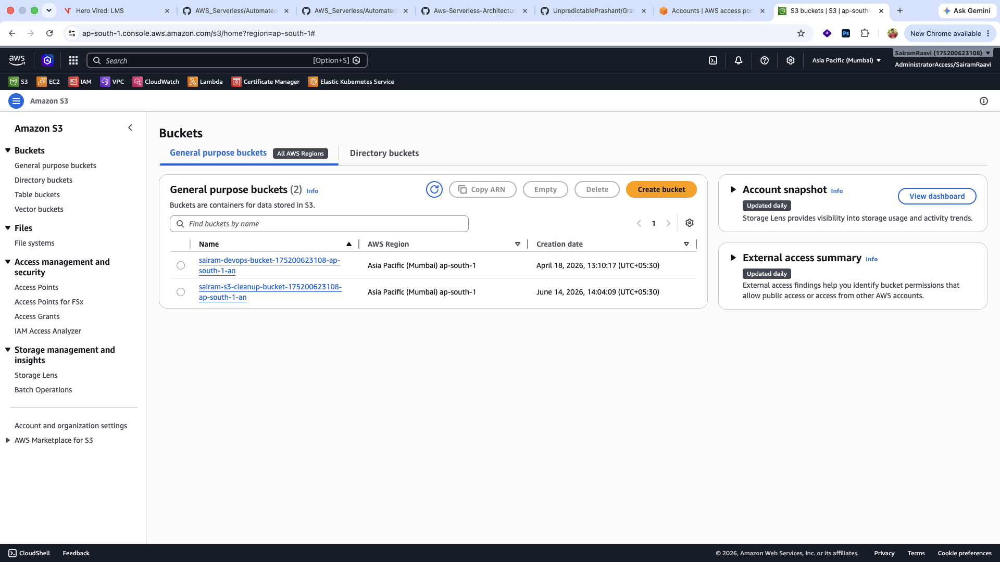
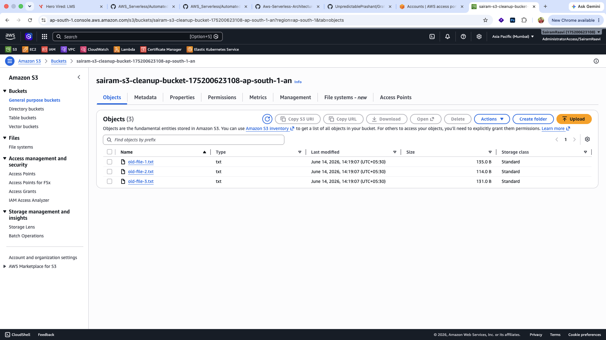
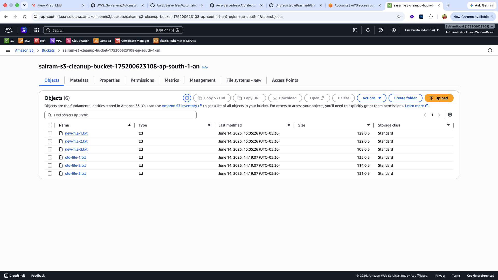
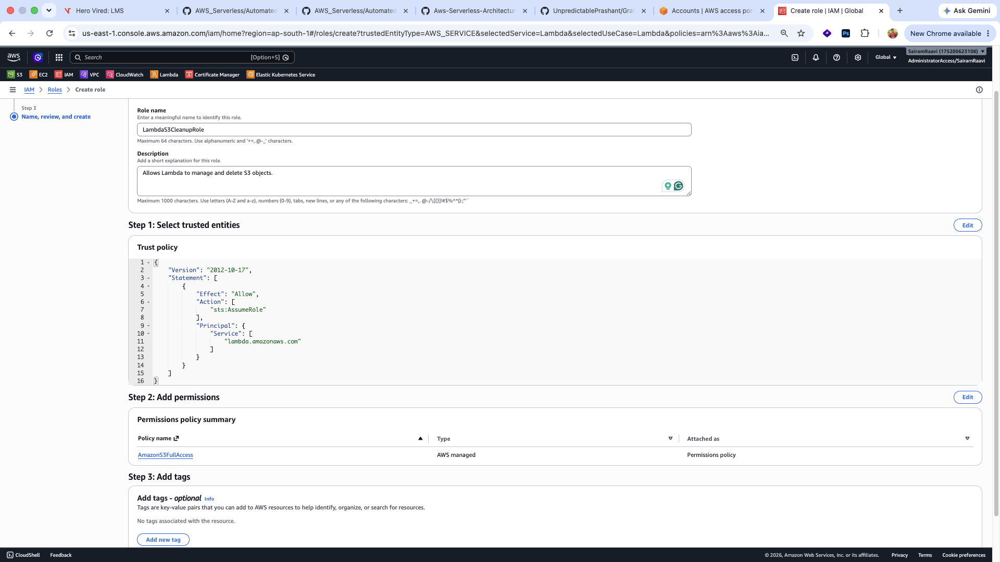
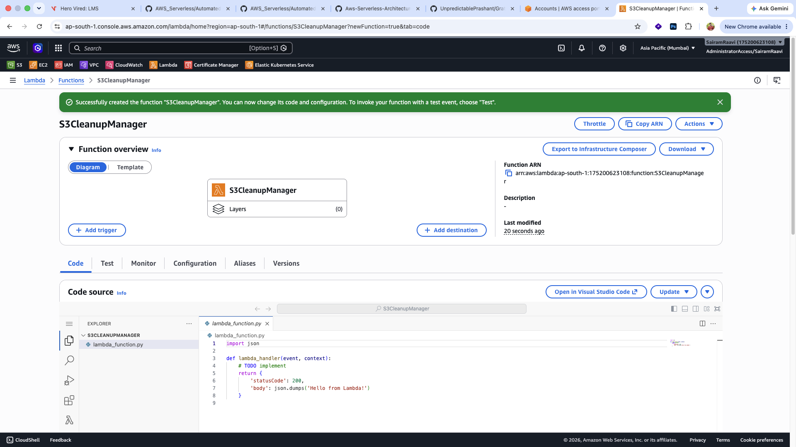
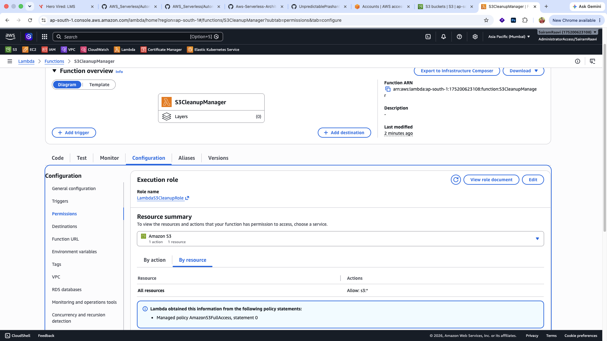
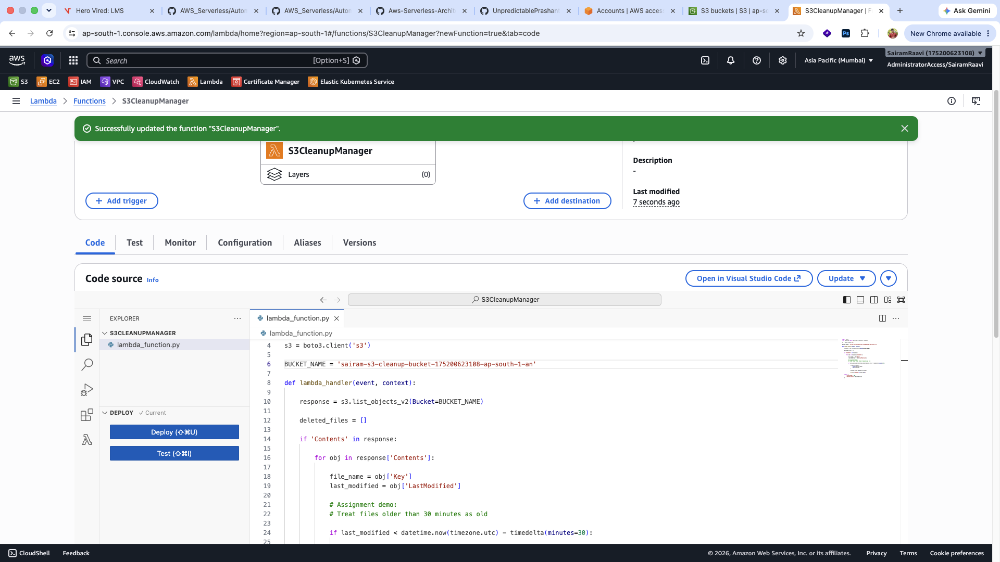
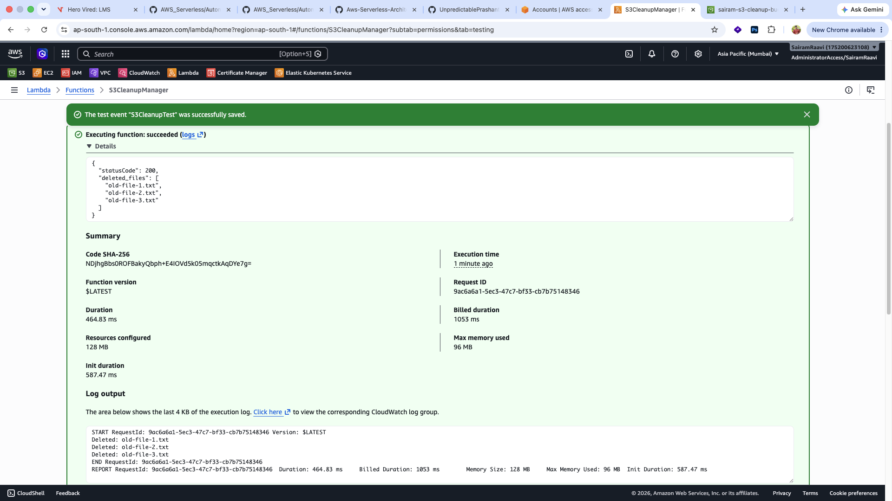
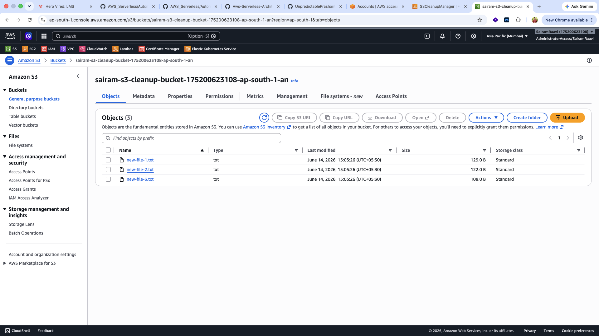

# Automated S3 Bucket Cleanup Using AWS Lambda and Boto3

## Assignment 2: AWS Serverless Architecture

### Objective

The objective of this assignment is to gain hands-on experience with AWS Lambda and Boto3 by creating an automated cleanup solution for Amazon S3. The Lambda function identifies files older than a specified age threshold and automatically deletes them from the S3 bucket.

---

# Architecture Overview

```text
Amazon S3 Bucket
       │
       │ List Objects
       ▼
 AWS Lambda Function
   (S3CleanupManager)
       │
       │ Boto3 SDK
       ▼
 Check Object Age
       │
       ├── Delete Old Files
       │
       └── Keep Recent Files
```

---

# Technologies Used

* Amazon S3
* AWS Lambda
* AWS IAM
* Python 3.x
* Boto3 SDK

---

# Step 1: Create an S3 Bucket

A new S3 bucket was created to store files for cleanup testing.

### Bucket Details

| Property | Value             |
| -------- | ----------------- |
| Service  | Amazon S3         |
| Purpose  | Automated Cleanup |
| Region   | ap-south-1        |

### Screenshot



---

# Step 2: Upload Test Files

To simulate cleanup scenarios, two groups of files were uploaded:

### Old Files

These files represent objects that should be deleted by the Lambda function.

* old-file-1.txt
* old-file-2.txt
* old-file-3.txt

### Screenshot



---

### New Files

These files represent recently uploaded objects that should remain in the bucket.

* new-file-1.txt
* new-file-2.txt
* new-file-3.txt

### Screenshot



---

# Step 3: Create IAM Role

An IAM role was created to allow Lambda to interact with Amazon S3.

### Role Details

| Setting         | Value               |
| --------------- | ------------------- |
| Role Name       | LambdaS3CleanupRole |
| Policy Attached | AmazonS3FullAccess  |

### Screenshot



---

# Step 4: Create Lambda Function

A Lambda function named **S3CleanupManager** was created.

### Configuration

| Setting        | Value               |
| -------------- | ------------------- |
| Function Name  | S3CleanupManager    |
| Runtime        | Python 3.x          |
| Execution Role | LambdaS3CleanupRole |

### Screenshot



---

# Step 5: Configure Lambda Permissions

The Lambda function was configured to use the IAM role created earlier.

### Screenshot



---

# Step 6: Implement Cleanup Logic Using Boto3

The Lambda function performs the following actions:

1. Connects to Amazon S3 using Boto3.
2. Lists all objects inside the bucket.
3. Checks the age of each object.
4. Identifies objects older than the configured threshold.
5. Deletes old objects.
6. Logs deleted object names.

### Lambda Source Code

```python
import boto3
from datetime import datetime, timezone, timedelta

s3 = boto3.client('s3')

BUCKET_NAME = 'your-bucket-name'

def lambda_handler(event, context):

    response = s3.list_objects_v2(Bucket=BUCKET_NAME)

    deleted_files = []

    if 'Contents' in response:

        for obj in response['Contents']:

            file_name = obj['Key']
            last_modified = obj['LastModified']

            if last_modified < datetime.now(timezone.utc) - timedelta(minutes=30):

                s3.delete_object(
                    Bucket=BUCKET_NAME,
                    Key=file_name
                )

                deleted_files.append(file_name)

                print(f"Deleted: {file_name}")

    return {
        'statusCode': 200,
        'deleted_files': deleted_files
    }
```

### Screenshot



---

# Step 7: Execute Lambda Function

A test event was created and the Lambda function was manually invoked.

### Test Event

```json
{}
```

### Screenshot



---

# Step 8: Verify Cleanup Results

After Lambda execution, the old files were successfully deleted from the bucket.

### Deleted Files

```text
old-file-1.txt
old-file-2.txt
old-file-3.txt
```

### Remaining Files

```text
new-file-1.txt
new-file-2.txt
new-file-3.txt
```

### Screenshot



---

# Results

The Lambda function successfully:

* Connected to Amazon S3.
* Retrieved the list of bucket objects.
* Identified files older than the configured threshold.
* Deleted outdated files automatically.
* Logged deleted file names.
* Preserved recently uploaded files.

---

# Learning Outcomes

Through this assignment, the following AWS concepts were practiced:

* Amazon S3 Bucket Management
* IAM Roles and Permissions
* AWS Lambda Function Development
* Boto3 SDK Integration
* Serverless Automation
* Automated File Cleanup Operations

---

# Conclusion

This assignment demonstrates how AWS Lambda and Boto3 can be used to automate storage management tasks in Amazon S3. By implementing an automated cleanup process, outdated files can be removed without manual intervention, improving storage efficiency and reducing operational overhead.

The solution successfully identified and deleted old files while retaining newer files, validating the effectiveness of serverless automation in AWS cloud environments.
