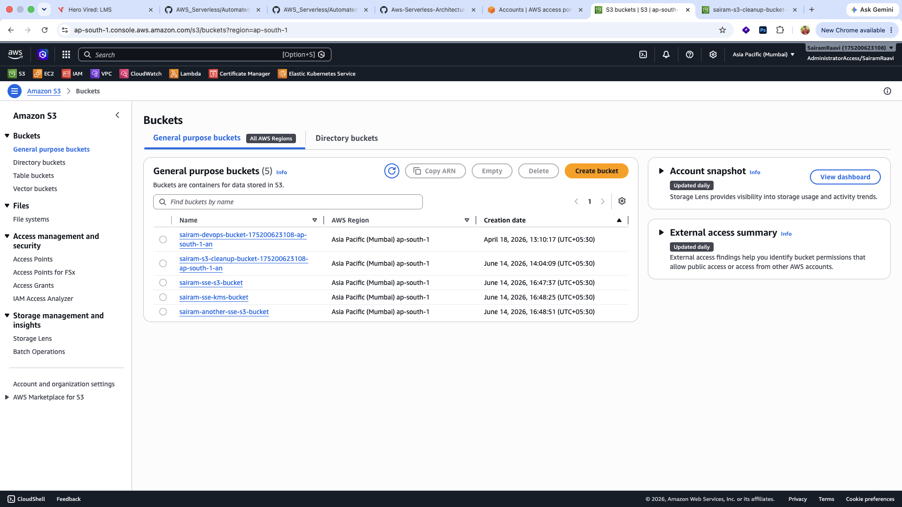
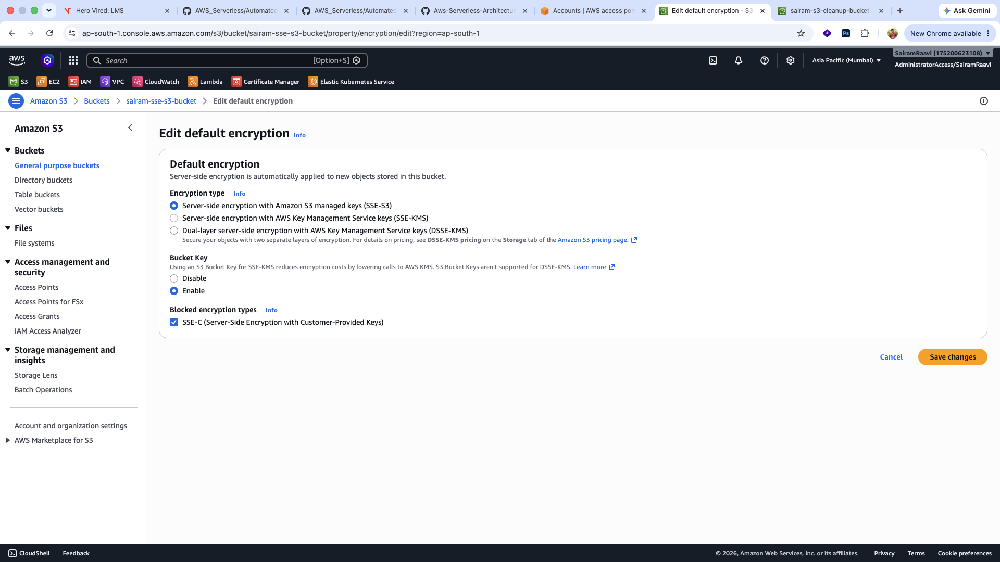
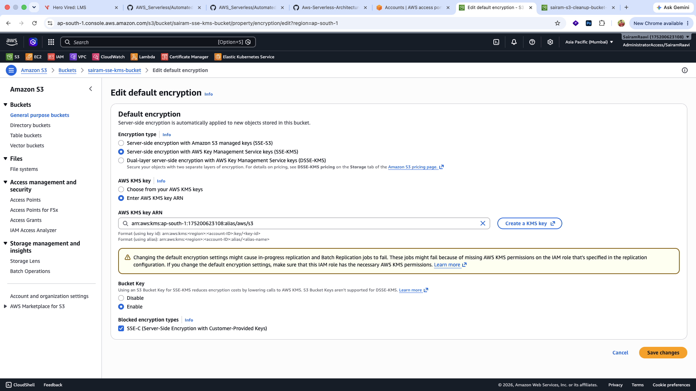
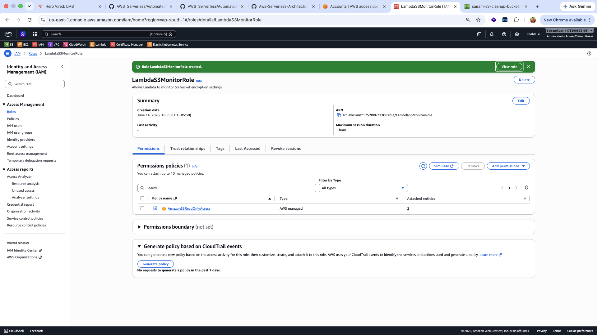
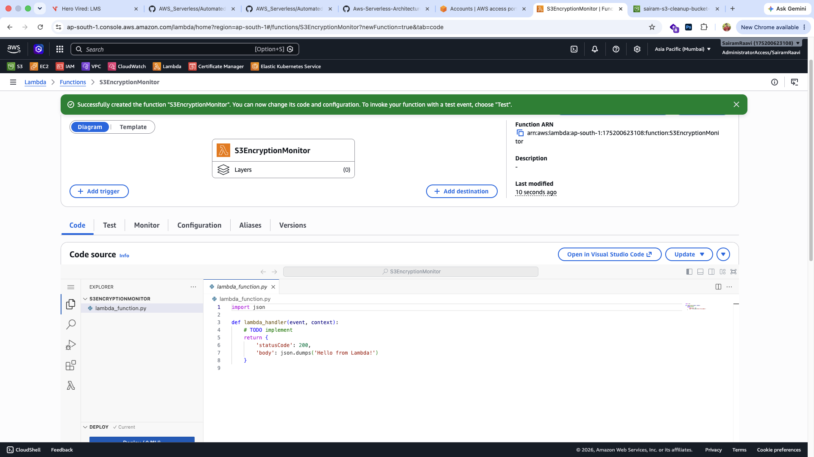
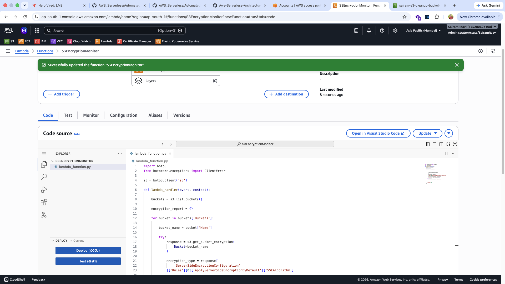
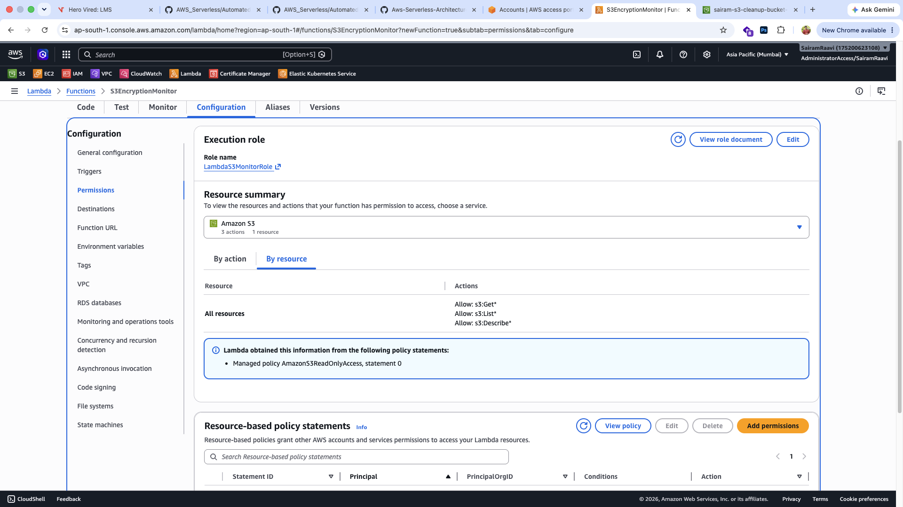
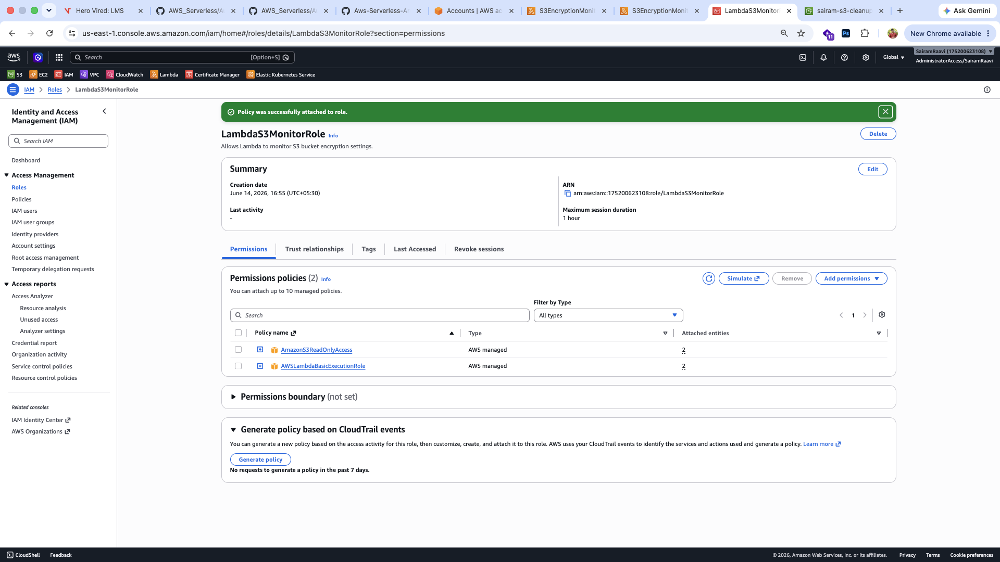
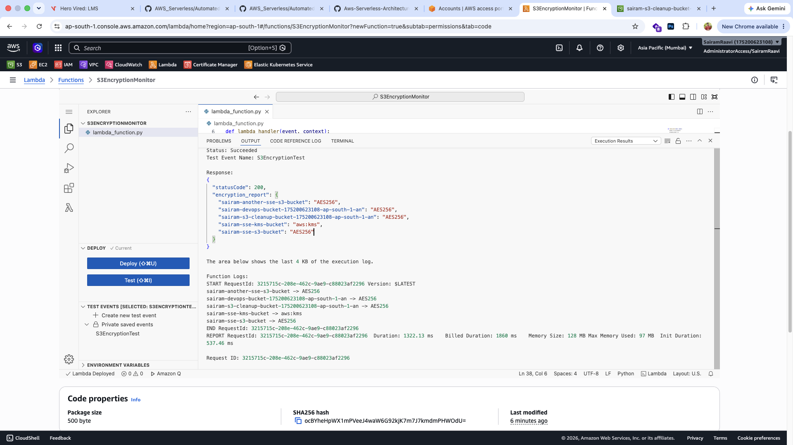
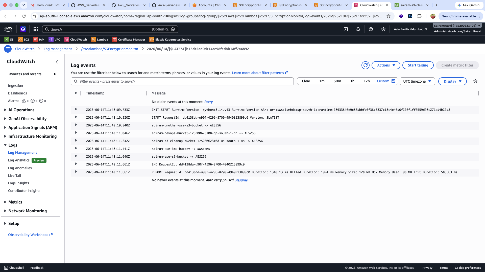

# Assignment 3: Monitor Unencrypted S3 Buckets Using AWS Lambda and Boto3

## Objective

The objective of this assignment is to enhance AWS security monitoring by creating an AWS Lambda function that identifies S3 buckets without server-side encryption and reports their encryption status using Boto3.

---

## Architecture Overview

This solution uses:

* Amazon S3
* AWS Lambda
* AWS IAM
* Amazon CloudWatch
* Boto3 (AWS SDK for Python)

The Lambda function performs the following actions:

1. Lists all S3 buckets.
2. Checks the encryption configuration of each bucket.
3. Identifies buckets that do not have encryption configured.
4. Logs bucket encryption details to CloudWatch Logs.
5. Returns an encryption report after execution.

---

# Step 1: Create S3 Buckets

Created three S3 buckets for testing encryption monitoring.

### Buckets Created

| Bucket Name                  | Encryption Type |
| ---------------------------- | --------------- |
| sairam-sse-s3-bucket         | SSE-S3          |
| sairam-sse-kms-bucket        | SSE-KMS         |
| sairam-another-sse-s3-bucket | SSE-S3          |

### Screenshots

#### Created S3 Buckets



#### SSE-S3 Bucket Configuration



#### SSE-KMS Bucket Configuration



---

# Step 2: Create IAM Role

Created a dedicated IAM role for Lambda execution.

### Role Details

| Property        | Value                  |
| --------------- | ---------------------- |
| Role Name       | LambdaS3MonitorRole    |
| Policy Attached | AmazonS3ReadOnlyAccess |

The role allows Lambda to read bucket configurations without modifying resources.

### Screenshot



---

# Step 3: Create Lambda Function

Created a Lambda function to monitor bucket encryption settings.

### Lambda Configuration

| Property       | Value               |
| -------------- | ------------------- |
| Function Name  | S3EncryptionMonitor |
| Runtime        | Python 3.x          |
| Execution Role | LambdaS3MonitorRole |

### Screenshot



---

# Step 4: Deploy Lambda Function Code

Implemented a Python script using Boto3 to:

* List all S3 buckets
* Retrieve bucket encryption settings
* Detect buckets without encryption
* Print encryption details to CloudWatch Logs

### Screenshot



---

# Step 5: Verify IAM Permissions

Verified that the Lambda function was associated with the correct IAM role.

### Screenshot



---

# Issue Encountered and Resolution

## Problem

After deploying the Lambda function, CloudWatch logs were not accessible from the Lambda Monitor tab.

The following warning was displayed:

> Missing permissions: Your function doesn't have permission to write to Amazon CloudWatch Logs.

This occurred because the execution role only had the following policy attached:

```text
AmazonS3ReadOnlyAccess
```

This policy allows reading S3 resources but does not allow Lambda to create or write CloudWatch log streams.

---

## Resolution

Attached the AWS managed policy:

```text
AWSLambdaBasicExecutionRole
```

to the Lambda execution role.

This policy grants permissions to:

* Create CloudWatch Log Groups
* Create Log Streams
* Write Log Events

After attaching the policy and rerunning the Lambda function, CloudWatch logging worked successfully.

### Screenshot



---

# Step 6: Execute Lambda Function

Created a test event and manually invoked the Lambda function.

### Expected Outcome

The Lambda function:

* Listed all S3 buckets
* Retrieved encryption settings
* Generated an encryption report
* Logged results to CloudWatch

### Screenshot



---

# Step 7: Review CloudWatch Logs

Verified that the Lambda function successfully logged encryption information for the monitored S3 buckets.

### Screenshot



---

# Results

The solution successfully:

* Created multiple S3 buckets with different encryption configurations.
* Created an IAM role with least-privilege read access.
* Implemented an AWS Lambda function using Boto3.
* Monitored S3 bucket encryption settings.
* Generated encryption reports.
* Logged monitoring information to CloudWatch Logs.
* Resolved CloudWatch permission issues using AWSLambdaBasicExecutionRole.

---

# Technologies Used

* AWS Lambda
* Amazon S3
* AWS IAM
* Amazon CloudWatch
* Python 3.x
* Boto3

---

# Conclusion

This assignment demonstrated how AWS Lambda and Boto3 can be used to automate security monitoring of Amazon S3 buckets. The solution successfully identified bucket encryption configurations, generated reports, and logged results through CloudWatch, improving visibility into S3 security posture.
