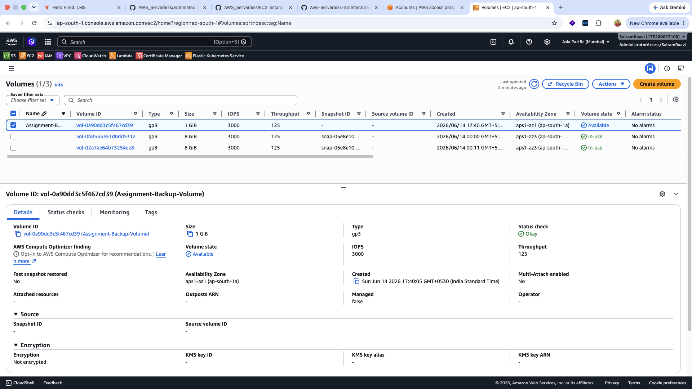
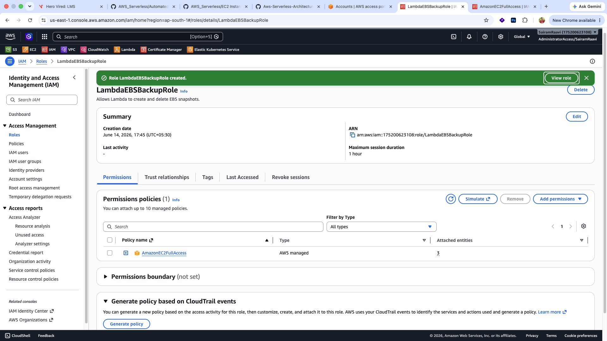
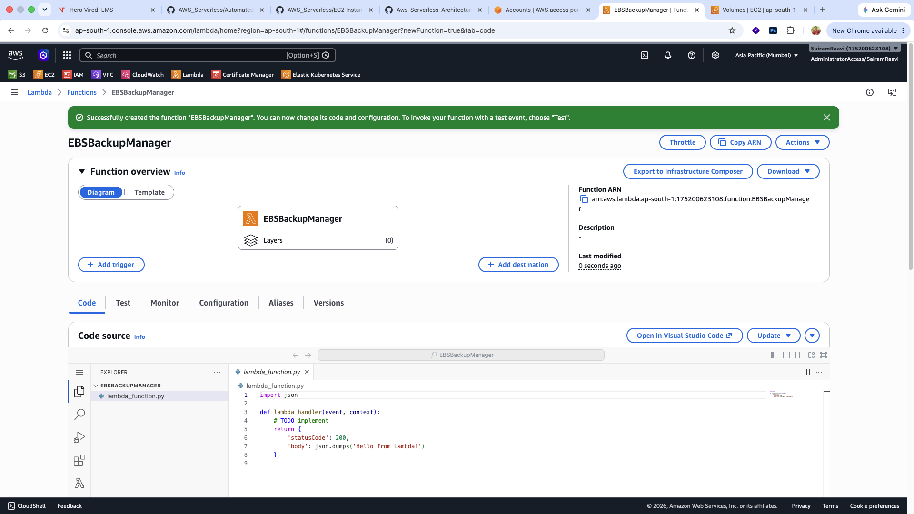
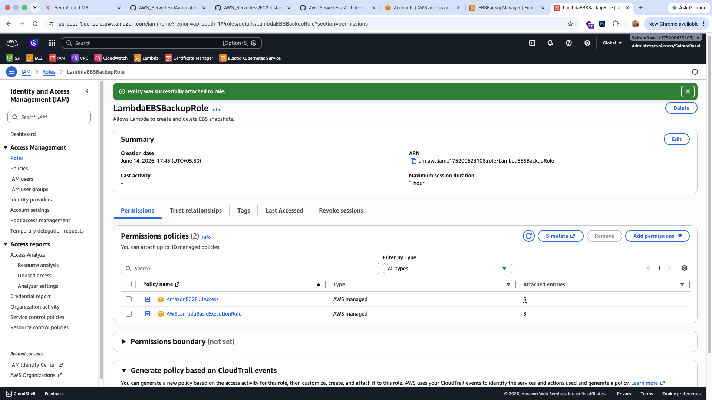
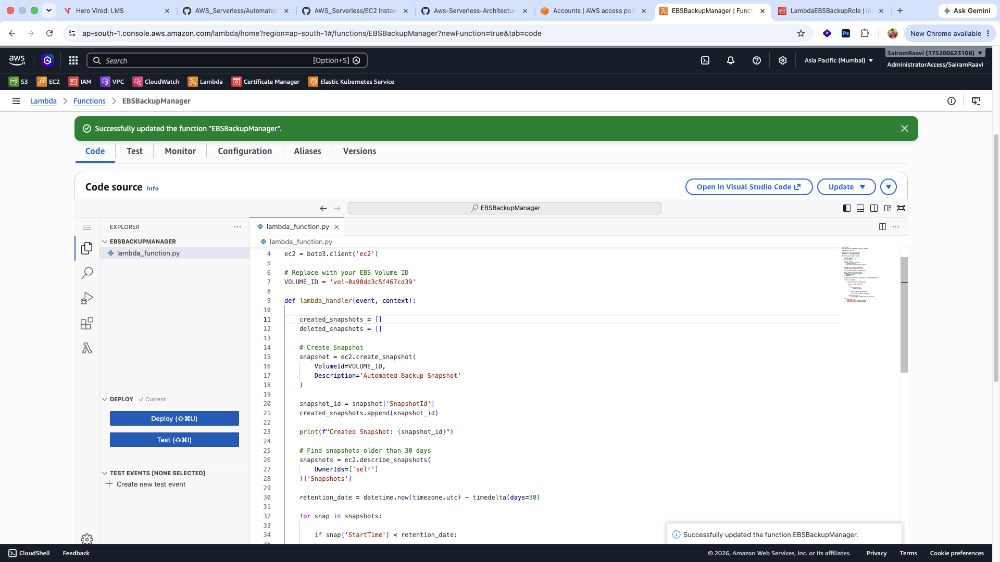
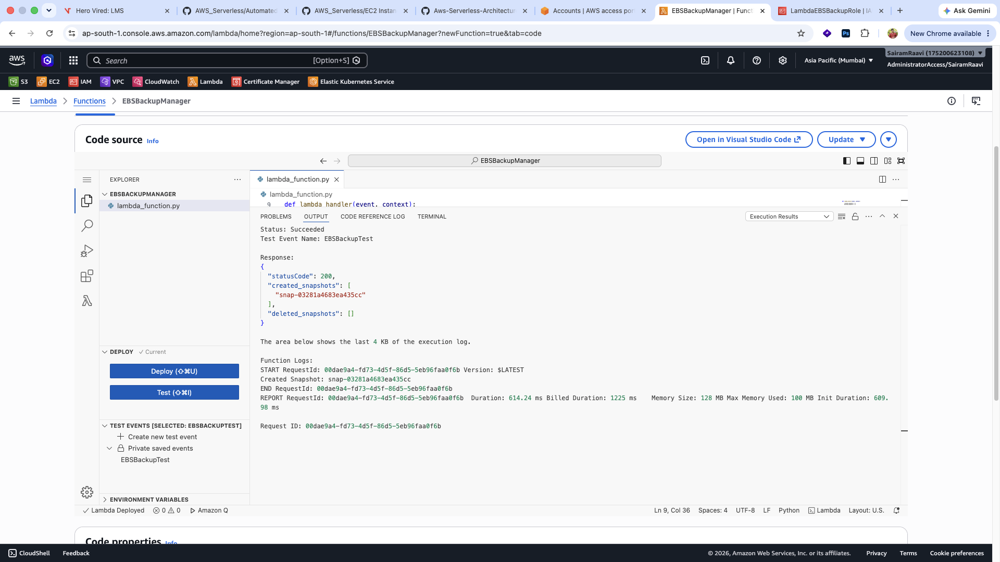
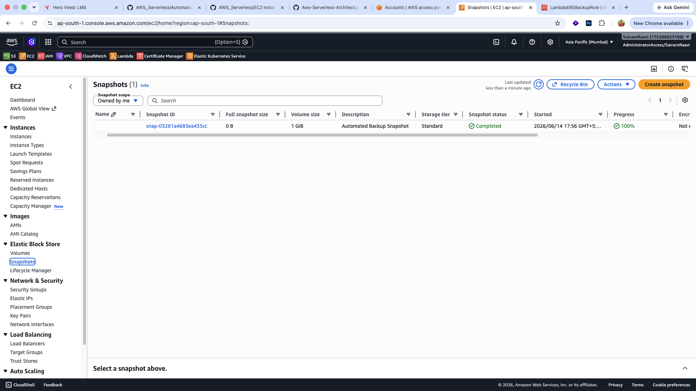
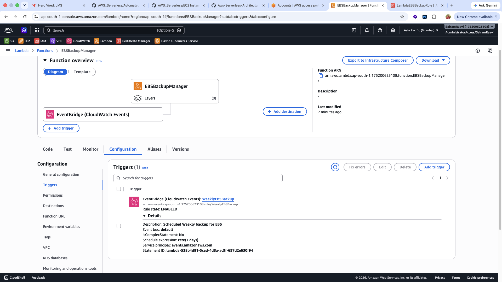

# Assignment 4: Automated EBS Snapshot Backup and Cleanup Using AWS Lambda and Boto3

## Objective

The objective of this assignment is to automate the backup process for Amazon EBS volumes using AWS Lambda and Boto3. The solution creates snapshots of specified EBS volumes and removes snapshots older than a defined retention period to optimize storage costs.

---

## Architecture

AWS Services Used:

* Amazon EC2 (EBS Volumes and Snapshots)
* AWS Lambda
* AWS IAM
* Amazon EventBridge (CloudWatch Events)
* Amazon CloudWatch Logs
* Boto3 (AWS SDK for Python)

---

## Step 1: EBS Volume Setup

Created a dedicated EBS volume to be used for backup testing.

### Volume Details

| Property    | Value                    |
| ----------- | ------------------------ |
| Volume Name | Assignment-Backup-Volume |
| Volume Type | gp3                      |
| Size        | 1 GiB                    |
| State       | Available                |

### Screenshot



---

## Step 2: IAM Role Creation

Created an IAM role for Lambda execution.

### Role Details

| Property        | Value               |
| --------------- | ------------------- |
| Role Name       | LambdaEBSBackupRole |
| Policy Attached | AmazonEC2FullAccess |

This role allows Lambda to:

* Create EBS snapshots
* List snapshots
* Delete old snapshots

### Screenshot



---

## Step 3: Lambda Function Creation

Created a Lambda function named:

```text
EBSBackupManager
```

### Runtime

```text
Python 3.x
```

### Execution Role

```text
LambdaEBSBackupRole
```

### Screenshot



---

## Step 4: CloudWatch Logging Permission

While testing the Lambda function, CloudWatch logging permissions were required.

Attached the following policy to the IAM role:

```text
AWSLambdaBasicExecutionRole
```

This enables:

* CloudWatch log creation
* Log stream creation
* Writing execution logs

### Screenshot



---

## Step 5: Lambda Function Code

Implemented a Boto3 script that:

1. Connects to EC2 using Boto3.
2. Creates a snapshot of the specified EBS volume.
3. Lists existing snapshots.
4. Deletes snapshots older than 30 days.
5. Logs created and deleted snapshot IDs.

### Features

* Automated snapshot creation
* Snapshot retention management
* CloudWatch logging support

### Screenshot



---

## Step 6: Manual Lambda Invocation

Created a test event and executed the Lambda function manually.

### Test Event

```json
{}
```

### Expected Result

* New EBS snapshot created
* Snapshot ID displayed in output
* Old snapshots deleted if older than 30 days

### Screenshot



---

## Step 7: Snapshot Verification

Verified that a new EBS snapshot was successfully created.

### Verification Performed

* Navigated to EC2 → Snapshots
* Confirmed snapshot creation
* Verified snapshot status as Completed

### Screenshot



---

## Step 8: Scheduled Automation Using EventBridge

Configured an EventBridge rule to automatically invoke the Lambda function every 7 days.

### Rule Details

| Property  | Value           |
| --------- | --------------- |
| Rule Name | WeeklyEBSBackup |
| Schedule  | rate(7 days)    |
| State     | Enabled         |

This ensures automatic weekly backups without manual intervention.

### Screenshot



---

## Challenge Encountered

### Issue

After creating the Lambda function, CloudWatch logs were not being generated.

### Cause

The execution role only had:

```text
AmazonEC2FullAccess
```

which does not provide permissions to write logs to CloudWatch.

### Resolution

Attached the following managed policy:

```text
AWSLambdaBasicExecutionRole
```

After attaching the policy:

* CloudWatch logs were generated successfully.
* Lambda execution logs became visible.
* Function monitoring worked correctly.

---

## Outcome

Successfully implemented an automated EBS backup solution that:

* Creates EBS snapshots automatically.
* Deletes snapshots older than 30 days.
* Logs operations to CloudWatch.
* Supports scheduled execution through EventBridge.
* Demonstrates AWS Lambda automation using Boto3.

---

## Screenshots Included

```text
screenshots/
├── created-ebs-volume.png
├── IAM-LambdaEBSBackupRole.png
├── created-lambda-function.png
├── Added-AWSLambdaBasicExecutionRole.png
├── Lambda-function-deployed.png
├── EBSBackupManager-Test-execution.png
├── snapshot-created.png
└── eventbridge-trigger-added.png
```
