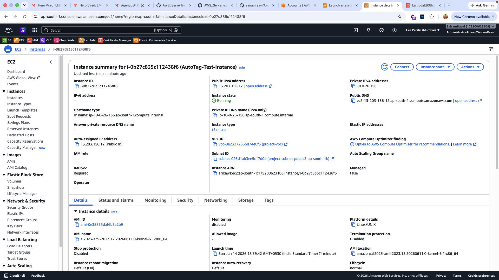
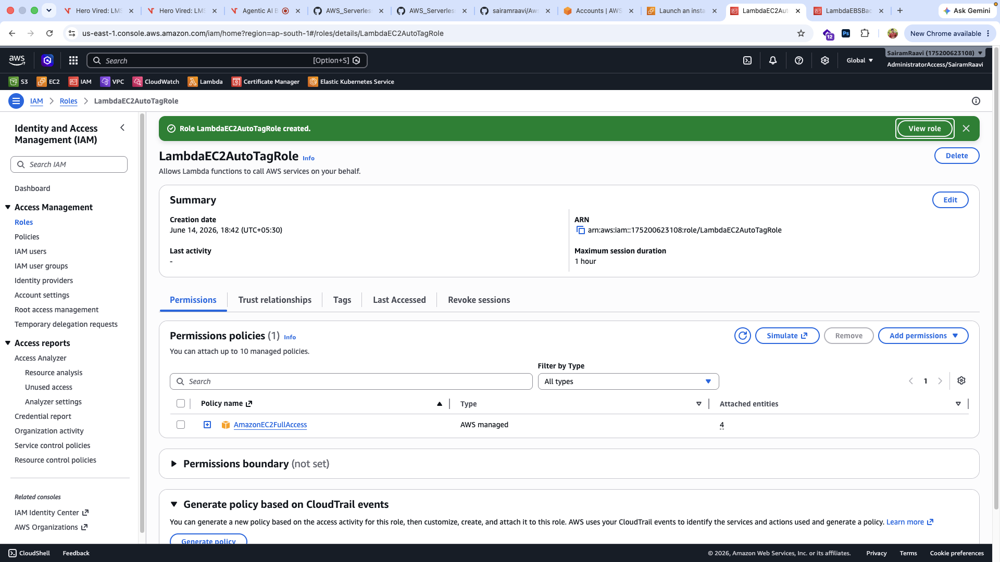
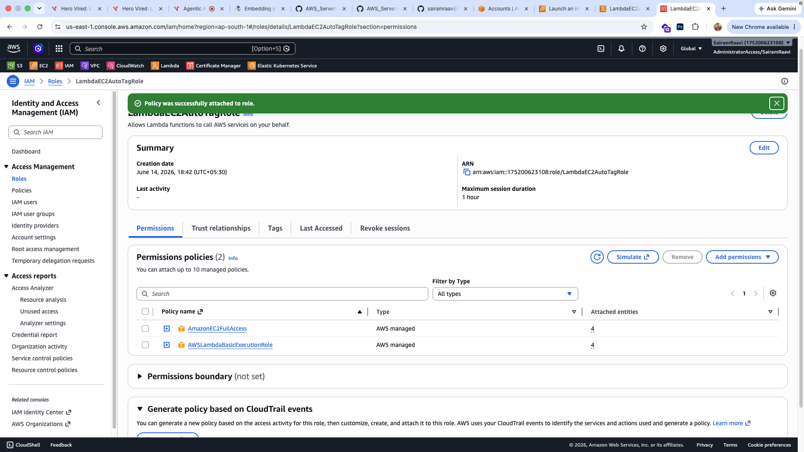
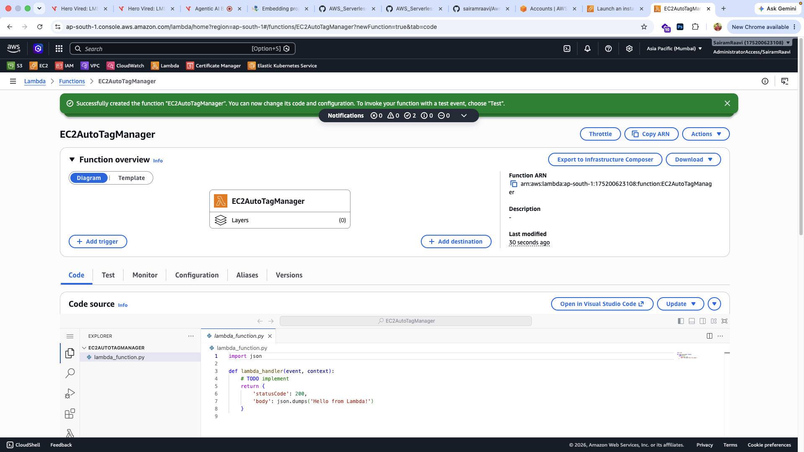
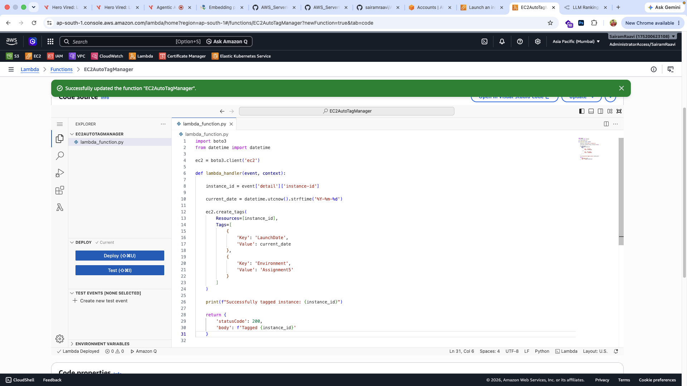
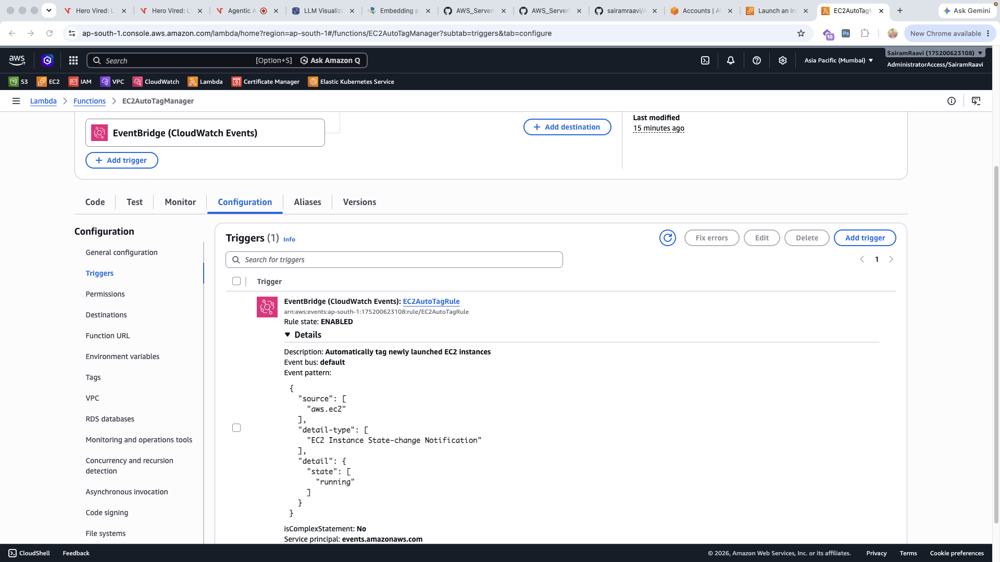
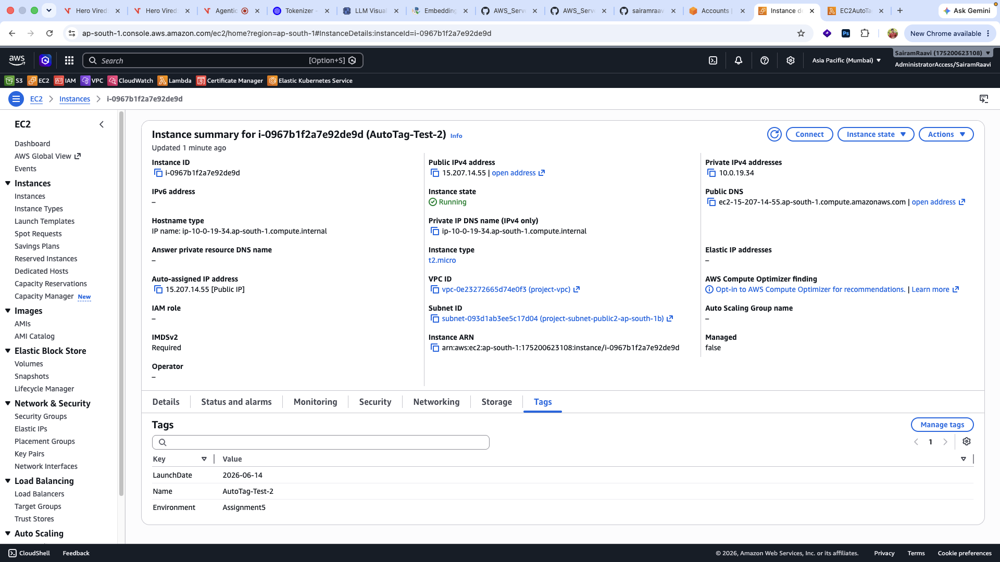
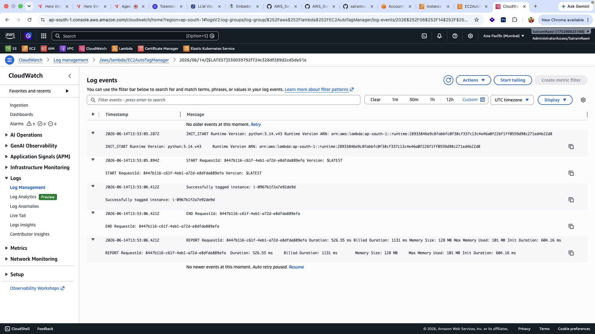

# Assignment 5: Auto-Tagging EC2 Instances on Launch Using AWS Lambda and Boto3

## Objective

The objective of this assignment is to automate the tagging of newly launched EC2 instances using AWS Lambda and Boto3. This helps improve resource tracking, management, and governance by automatically applying standard tags whenever an EC2 instance is launched.

---

# Architecture Overview

AWS Services Used:

* Amazon EC2
* AWS Lambda
* AWS IAM
* Amazon EventBridge (CloudWatch Events)
* Amazon CloudWatch Logs
* Boto3 (AWS SDK for Python)

---

# Step 1: EC2 Setup

Created an EC2 instance to test the automated tagging workflow.

### EC2 Instance Details

| Property         | Value                |
| ---------------- | -------------------- |
| Instance Purpose | Testing Auto Tagging |
| Service          | Amazon EC2           |
| Launch Method    | Manual Launch        |

### Screenshot



---

# Step 2: Create IAM Role for Lambda

Created an IAM role to allow Lambda to manage EC2 instance tags.

### IAM Configuration

| Property        | Value                |
| --------------- | -------------------- |
| Role Name       | LambdaEC2AutoTagRole |
| Trusted Entity  | AWS Lambda           |
| Policy Attached | AmazonEC2FullAccess  |

### Screenshot



---

# Step 3: Add CloudWatch Logging Permissions

To enable Lambda execution logging, an additional managed policy was attached.

### Additional Policy

```text
AWSLambdaBasicExecutionRole
```

This policy allows:

* CloudWatch Log Group creation
* CloudWatch Log Stream creation
* Writing Lambda execution logs

### Screenshot



---

# Step 4: Create Lambda Function

Created a Lambda function to automatically apply tags to EC2 instances.

### Lambda Configuration

| Property       | Value                |
| -------------- | -------------------- |
| Function Name  | EC2AutoTagManager    |
| Runtime        | Python 3.x           |
| Execution Role | LambdaEC2AutoTagRole |

### Screenshot



---

# Step 5: Deploy Lambda Function

Implemented a Boto3 script that:

1. Retrieves the EC2 Instance ID from the EventBridge event.
2. Generates the current date.
3. Applies custom tags to the EC2 instance.
4. Writes execution details to CloudWatch Logs.

### Tags Applied

| Tag Key     | Tag Value    |
| ----------- | ------------ |
| LaunchDate  | Current Date |
| Environment | Assignment5  |

### Screenshot



---

# Step 6: Configure EventBridge Rule

Created an EventBridge rule to automatically invoke the Lambda function whenever an EC2 instance enters the **Running** state.

### Event Configuration

| Property      | Value                                  |
| ------------- | -------------------------------------- |
| Rule Name     | EC2AutoTagRule                         |
| Event Source  | EC2                                    |
| Event Type    | EC2 Instance State-change Notification |
| Trigger State | Running                                |
| Target        | EC2AutoTagManager                      |

### Screenshot



---

# Step 7: Automatic Tagging Verification

Launched a new EC2 instance after configuring the EventBridge rule.

The Lambda function automatically added the required tags.

### Verified Tags

| Key         | Value        |
| ----------- | ------------ |
| LaunchDate  | Current Date |
| Environment | Assignment5  |

### Screenshot



---

# Step 8: CloudWatch Log Verification

Verified successful Lambda execution through CloudWatch Logs.

### Example Log Output

```text
Successfully tagged instance: i-xxxxxxxxxxxxxxxxx
```

This confirms that:

* EventBridge triggered Lambda successfully.
* Lambda retrieved the Instance ID.
* Tags were applied successfully.
* Logging functionality worked correctly.

### Screenshot



---

# Challenge Encountered

## Issue

Initially, Lambda executed successfully but monitoring and log visibility were unavailable because CloudWatch logging permissions were not configured.

## Root Cause

The IAM role only contained:

```text
AmazonEC2FullAccess
```

This policy allows EC2 operations but does not provide permissions for CloudWatch logging.

## Resolution

Attached the managed policy:

```text
AWSLambdaBasicExecutionRole
```

After attaching the policy:

* CloudWatch Logs were generated successfully.
* Lambda execution details became visible.
* Monitoring functionality worked correctly.

---

# Outcome

Successfully implemented an automated EC2 tagging solution using AWS Lambda and EventBridge.

The solution:

* Automatically detects newly launched EC2 instances.
* Applies standardized tags automatically.
* Improves resource organization and governance.
* Generates CloudWatch logs for auditing and monitoring.
* Requires no manual tagging after deployment.

---

# Screenshots Included

```text
screenshots/
├── created-ec2-instance.png
├── IAM-LambdaEC2AutoTagRole.png
├── Added-AWSLambdaBasicExecutionRole.png
├── created-lambda-function.png
├── Lambda-function-deployed.png
├── eventbridge-rule-created.png
├── instance-auto-tagged.png
└── CloudWatch-logs.png
```

---

# Conclusion

This assignment successfully demonstrated how AWS Lambda and Boto3 can be used to automate EC2 instance management tasks. By integrating Amazon EventBridge with Lambda, newly launched EC2 instances were automatically detected and tagged without any manual intervention.

The implemented solution provides:

- Automated resource tagging for improved management and tracking.
- Consistent tagging standards across EC2 instances.
- Event-driven serverless automation using AWS Lambda.
- Centralized monitoring through Amazon CloudWatch Logs.
- Reduced administrative effort and improved operational efficiency.

This implementation highlights the power of AWS serverless services in automating cloud operations and enforcing resource governance practices.